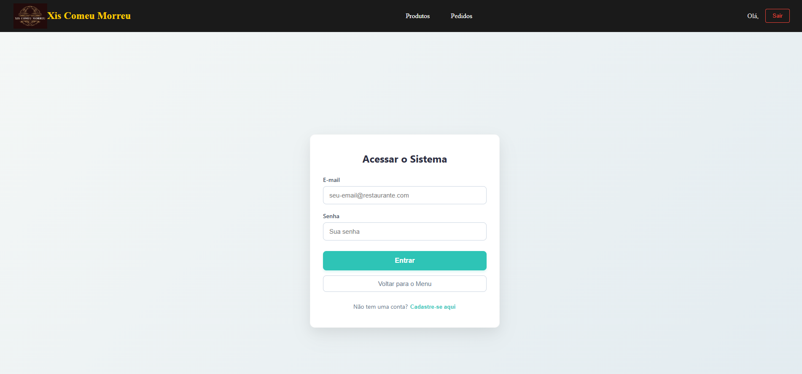
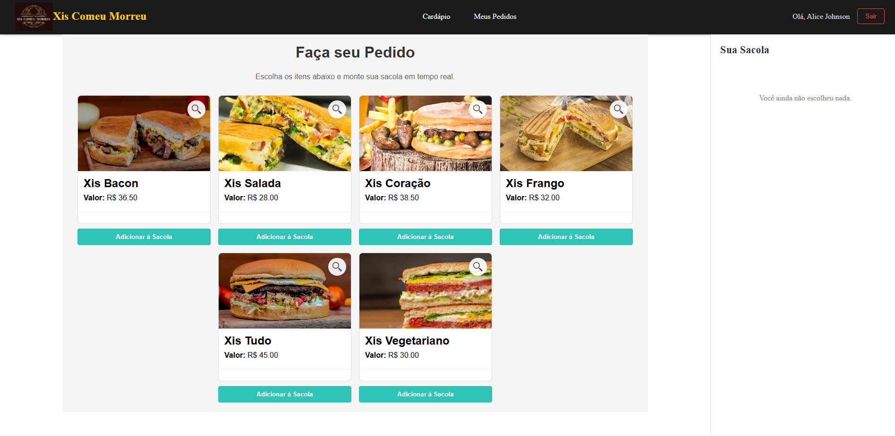
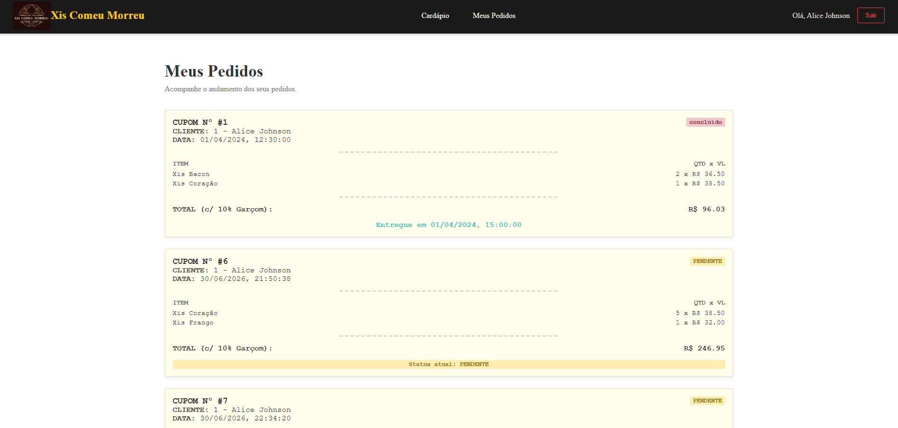
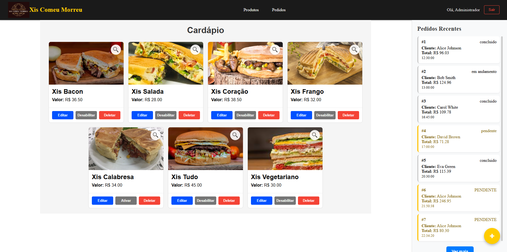
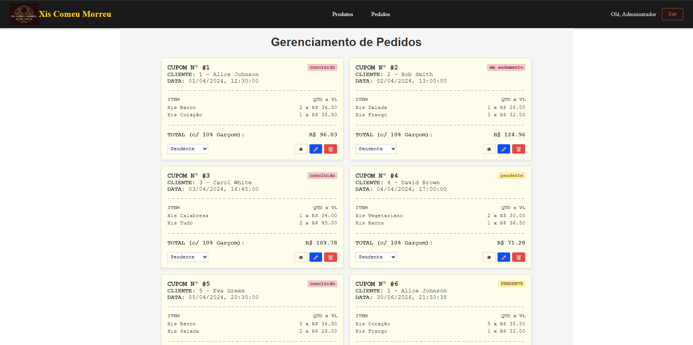

# 🍔 Xis Comeu Morreu

Sistema de gerenciamento de pedidos para uma lanchonete, desenvolvido utilizando **Spring Boot** no Back-End e **React + TypeScript** no Front-End.

O sistema possui dois perfis de acesso:

- 👨‍💼 Administrador
- 👤 Cliente

Cada perfil possui funcionalidades específicas para gerenciamento do estabelecimento e realização de pedidos.

---

# 📋 Funcionalidades

## Cliente

- Login
- Cadastro de usuário
- Visualização do cardápio
- Consulta dos detalhes dos produtos
- Adição de produtos à sacola
- Alteração da quantidade dos itens
- Finalização do pedido
- Acompanhamento do status dos pedidos

## Administrador

- Login
- Cadastro de produtos
- Edição de produtos
- Exclusão de produtos
- Ativação e desativação de produtos
- Visualização detalhada dos produtos
- Gerenciamento de pedidos
- Alteração do status dos pedidos
- Visualização dos detalhes dos pedidos

---

# 🛠 Tecnologias utilizadas

## Front-End

- React
- TypeScript
- Vite
- Axios
- React Query
- React Router

## Back-End

- Java 23
- Spring Boot
- Spring Data JPA
- Hibernate
- Maven

## Banco de Dados

- MySQL

---

# 🚀 Como executar o projeto

## Pré-requisitos

- Java 23 ou superior
- Node.js 20 ou superior
- npm
- MySQL
- IntelliJ IDEA (ou outra IDE Java)

---

## 1 - Clonar o repositório

```bash
git clone https://github.com/seu-usuario/seu-repositorio.git
```

---

## 2 - Configurar o Banco de Dados

Criar um banco MySQL.

Exemplo:

```sql
CREATE DATABASE xis_comeu_morreu;
```

Editar o arquivo:

```
src/main/resources/application.properties
```
E inserir as credenciais do seu banco
---

## 3 - Executar o Back-End

Abra o projeto Back-End no IntelliJ IDEA.

Execute a classe:

```
MenuBackendApplication.java
```

O servidor será iniciado em:

```
http://localhost:8080
```

---

## 4 - Executar o Front-End

Abra um terminal na pasta do Front-End.

Instale as dependências:

```bash
npm install
```

Depois execute:

```bash
npm run dev
```

O Vite iniciará normalmente em:

```
http://localhost:5173
```

---

# 📂 Estrutura do Projeto

```
Backend
│
├── controller
├── service
├── repository
├── model
├── dto
└── config

Frontend
│
├── componentes
├── hooks
├── interfaces
├── pages
├── assets
└── styles
```

---

# 📷 Telas

- Login

- Cardápio

- Meus Pedidos

- Administração de Produtos

- Administração de Pedidos

*(Inserir screenshots futuramente)*

---

# 👨‍💻 Autor

- Giuliano Sallin Trevisan
- Herysson Rodrigues Figueiredo (Projeto Base)
---

# 📄 Licença

Projeto desenvolvido para fins acadêmicos.
